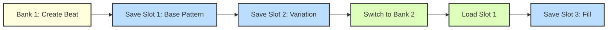
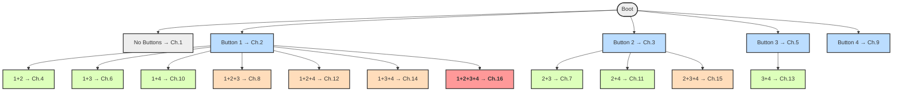

# 🥁 UTF-9 Drum Computer — Enhanced Features & Documentation  

This document describes the **full feature set, workflows, MIDI handling, and wiring** of the UTF-9 drum computer firmware.  

---

## ✨ Improvements in this Firmware  

- **Data type optimization** → leaner and faster code  
- **Simplified structure** → easier to read & hack  
- **Memory savings** → leaves more room for features  
- **Save/Load system** → intuitive and live-ready  
- **Better workflow** → reverse mode, global tempo, auto-load  

---

## 🎛️ Controls at a Glance  

```
[1] [2] [3] [4]
 |   |   |   |
 |   |   |   +-- Triggers / Save/Load Slots
 |   |   +------ Bank switching
 |   +---------- Variations / MIDI select
 +-------------- Variations / MIDI select
```

### Special Buttons
```
[REC]   [PLAY]   [TAP]   [SHIFT]
  |       |        |        |
  +-- Save |   Start/Stop   |-- Modifier
           |   + Reverse    |
```

---

## 💾 Save / Load System  

Fast and simple:  

```
SHIFT + [1-4]          → LOAD pattern from slot
SHIFT + REC + [1-4]    → SAVE pattern to slot
SHIFT + PLAY           → REVERSE mode
```

➡️ Store one pattern in multiple slots for **variations**.  

---

## 🧩 Mode Features  

- **Global Tempo** → one BPM for everything (no confusion!)  
- **Metronome OFF in saves** → no unwanted clicks  
- **Auto-Load on Boot** → last saved bank & settings restored at power-up  

---

## 🚀 Example Workflow  



Perform by jumping between slots instantly:  
```
SHIFT+Btn1 → load Slot 1 instantly
SHIFT+Btn2 → load Slot 2 instantly
SHIFT+Btn3 → load Slot 3 instantly
```

---

## 🕹️ Complete Control Summary  

| Action | Keys |
|--------|------|
| **Trigger sounds** | Buttons 1-4 |
| **Load pattern** | SHIFT + Button 1-4 |
| **Save pattern** | SHIFT + REC → Button 1-4 |
| **Switch banks** | SHIFT + TAP + Button 1-4 |
| **Reverse mode** | SHIFT + PLAY |
| **MIDI channel select (on boot)** | Hold binary button combo |

---

## 🎹 MIDI Channel Selection  

On boot, hold button combos to select MIDI channel **1–16**.  
Channel is saved to **EEPROM** and remembered!  

### Button Map  

```
[1] [2]
[3] [4]
```

### Mermaid Tree  



### 🌈 Color Key
- **Gray** → Default (no buttons)  
- **Blue** → Single button → Channels 2,3,5,9  
- **Green** → Two buttons → Channels 4,6,7,10,11,13  
- **Orange** → Three buttons → Channels 8,12,14,15  
- **Red** → All four buttons → Channel 16  

---

## ⏱️ MIDI Clock → Modular Converter  

```
Sequencer Playing → Pin 12 = Internal Clock
Sequencer Stopped → Pin 12 = MIDI Clock passthrough
```

So your drum computer doubles as a **MIDI-to-CV clock bridge** when idle!  

### Config Options (in code top)  
```cpp
#define MIDI_CLOCK_DIVIDER 6  // Clock division
#define MIDI_AUTO_START 0     // Auto start/stop with MIDI
```

- Clock divisions:  
  ```
  1  = 24 ppqn (fastest)
  2  = 12 ppqn
  4  =  6 ppqn (16ths)
  6  =  4 ppqn (8ths) [default]
  12 =  2 ppqn (quarters)
  24 =  1 ppqn (halves)
  48 =  0.5 ppqn (wholes)
  ```

- Auto Start:  
  ```
  0xFA → Start
  0xFC → Stop
  0xFB → Continue
  ```

---

## 🔌 ASCII Wiring Schematic  

```
        Arduino Nano (Top View)
       +-----------------------+
 D2 ---| [BTN1]                |
 D3 ---| [BTN2]                |
 D4 ---| [BTN3]                |
 D5 ---| [BTN4]                |
 D6 ---| [REC]                 |
 D7 ---| [PLAY]                |
 D8 ---| [TAP]                 |
 D9 ---| [SHIFT]               |
 D10-->| [AUDIO OUT] → 3.5mm jack
 D11-->| [MIDI OUT TX] → DIN pin 5
 D12-->| [CLOCK OUT] → modular clock
       |                       |
 5V ---+--> Buttons (via pull-downs)
 GND --+--> Common ground
       +-----------------------+
```

- **Buttons**: momentary switches to GND, Nano pins set as `INPUT_PULLUP`  
- **Audio Out**: simple DAC resistor ladder / PWM filter  
- **MIDI Out**: standard 220Ω resistor → DIN 5-pin  
- **Clock Out**: 5V pulse to Eurorack/Modular  

---

## 🔑 Key Features  

✔️ 4-Track step sequencer with save/load workflow  
✔️ Reverse mode for instant twists  
✔️ Global tempo & auto-load  
✔️ MIDI channel select via boot buttons  
✔️ Modular-ready clock output  
✔️ Optimized, Nano-friendly code  
✔️ **Proven beginner-friendly hardware** → every single workshop build worked  

---

## ⚡ Hack It  

The code is well-commented and modular.  
Fork it, bend it, remix it. Pull requests welcome 🎉  
